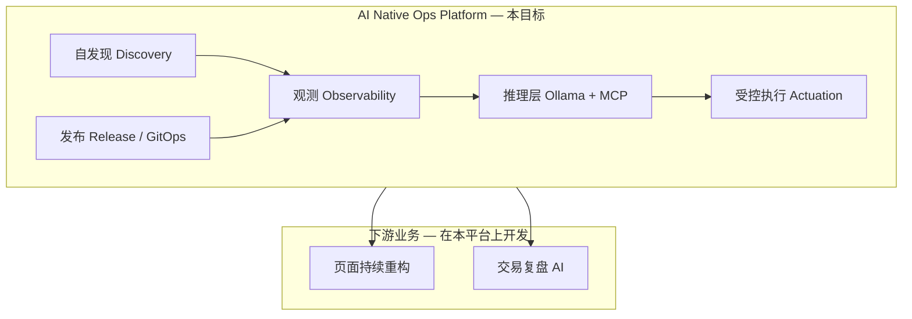

# AI 原生发布运维平台（重点构建目标）

> **制定**：2026-06-08 · **状态**：重点构建（规划 → 2C-B 后落地）
>
> **合并来源**：原「项目 1 — 快速开发发布 + AI 辅助重构」与「项目 2 — 全网络 AI 运维」合并为 **单一平台目标**。

---

## §1 一句话目标

构建一套 **AI 原生、可自发现、自维护、自修复** 的发布与运维环境，让现有 Bifrost Trade 业务（前端、API、Worker、Socket）在此环境上 **安全、可观测、可回滚** 地持续演进；并作为两条下游产品线的 **统一底座**：

1. **页面持续重构**（Dense UI / 前端迁移与等价验证）
2. **交易复盘 AI**（只读数据分析与建议，与交易执行路径隔离）

---

## §2 为什么合并为一项

| 原项目 | 核心诉求 | 合并理由 |
|--------|----------|----------|
| 快速发布 + AI 重构 | 缩短从 commit 到 Prod 的路径；Agent 可读迁移文档与 CI 信号 | 发布链路与运维观测是 **同一套事实来源**（Git、镜像、健康、日志、事件） |
| 全网 AI 运维 | 集群/服务自发现；异常诊断；受控修复 | 没有 GitOps + 观测 + 权限分级，AI 只能「建议」无法「闭环」 |

拆成两个项目会导致：两套 MCP、两套上下文、两套闸门。合并后 **一个平台、一套 Tool 契约、一条发布主线**。



---

## §3 平台能力定义

### 3.1 自发现（Discovery）

系统自动暴露 **可被 Agent 与人类理解的拓扑与状态**，无需手工维护端口表或 SSH 查日志。

| 对象 | 来源 | 消费方 |
|------|------|--------|
| 服务清单 | K8s API / Compose labels → 统一清单 | MCP、`/api/docs`、MkDocs |
| 健康与依赖 | Monitor + Ops + Socket health Redis | 发布闸门、AI 上下文 |
| 配置与版本 | Git tag、镜像 digest、ArgoCD sync 状态 | 回滚决策、复盘报告 |
| 迁移进度 | `MIGRATION_TRACKING.md`、Goal、Sign-off | 前端重构 Agent |

### 3.2 自维护（Maintenance）

日常变更 **默认走自动化**，人工仅处理策略与例外。

| 能力 | 实现方向 |
|------|----------|
| 构建与测试 | Tekton Pipeline：lint / pytest / `npm run build` / `check:legacy-css` |
| 发布 | ArgoCD GitOps；`release_gate.sh` 聚合 `prod-health` |
| 配置漂移检测 | ArgoCD diff + 定期 `make prod-health`（Mac Mini 哨兵） |
| 文档同步 | MkDocs + Goal 目录；迁移签字与路线图同源 |

### 3.3 自修复（Repair）

AI 与规则引擎在 **权限边界内** 尝试恢复，而非仅告警。

| 级别 | 行为 | 示例 |
|------|------|------|
| L0 只读 | 诊断、根因摘要、Runbook 链接 | Celery queue 堆积、Socket IB 黄灯 |
| L1 安全重试 | 经 Ops API 的已验操作 | `retry-failed`、重启 Celery worker instance |
| L2 受控变更 | 需 Owner 确认或 PR | ArgoCD rollback、扩缩容 |
| **禁止** | LLM 直连交易 | `daemon_control` 写、`ib:operator:cmd`、R-DV3 违反 |

---

## §4 下游业务：在本平台上推进

平台 **不是** 替代业务开发，而是降低业务迭代的摩擦与风险。

### 4.1 页面持续重构（前端）

| 需求 | 平台如何支撑 |
|------|----------------|
| Phase 1：New Frontend + Legacy API 等价验证 | CI 跑 `lint && build && check:legacy-css`；Staging 与 Prod 同镜像策略 |
| Dense UI 迁移 | UI Design System 页 + Goal/MIGRATION 文档进入 MCP 上下文 |
| 单页发布 | 前端独立 ArgoCD Application；nginx/Ingress 路由不变 |
| 回归 | `release_gate` 含关键 URL smoke；可选视觉/业务对比清单 |

**业务出口**：新前端全页业务等价 → Phase 2 API 逐域切换（migration-protocol）→ Legacy 退役。

详见：`bifrost-trade-frontend` · `docs/DENSE_UI.md` · `docs/DENSE_UI_PHASE_ROADMAP.md`（infra 侧索引）。

### 4.2 交易复盘 AI

| 需求 | 平台如何支撑 |
|------|----------------|
| 只读数据 | 同一 PG/API 观测面；复盘 Job 用只读角色或副本 |
| 向量与批处理 | K8s CronJob @ gpu-server；pgvector 或 Qdrant |
| Agent 接口 | 统一 MCP Tools（与运维共用发现层，**权限隔离**） |
| 前端（后期） | `/research/copilot` — 建议与报告，无下单写路径 |

**业务出口**：日终/按策略复盘报告；SEPA/持仓/成交问答；与 daemon 执行完全隔离。

---

## §5 技术栈与阶段（与 PLATFORM_ROADMAP 对齐）

平台分 **Compose 过渡期** 与 **K3s 目标态** 两档实现，能力契约保持一致。

| 阶段 | 时间盒 | 平台交付物 | 业务可开始 |
|------|--------|------------|------------|
| **A — 闸门** | 现在 ~3 月 | `release_gate.sh`、Mac Mini CI、MkDocs+Goal、2C-B Prod | 页面重构继续；复盘 AI **离线**试验（4090 Ollama） |
| **B — GitOps** | 3~9 月 | K3s + Gitea + Tekton + ArgoCD + `k8s/base/` | 前端 Staging on K8s；复盘索引 CronJob |
| **C — 闭环** | 9~18 月 | Prometheus/Loki/Grafana + `bifrost-ops-mcp` + AlertManager | 运维 Copilot 生产可用；复盘 RAG 接 Open-WebUI |

**硬件映射**（不变）：Win11 = TWS 专机；mini-pc-a = 控制面；mini-pc-b = PG/CNPG；4090 = GPU Agent；Mac Mini = Dev/CI/哨兵。

执行细节：[PLATFORM_ROADMAP.md](../docs/PLATFORM_ROADMAP.md) · [K3S_PLATFORM_ARCHITECTURE.md](../docs/K3S_PLATFORM_ARCHITECTURE.md)

---

## §6 建议新增代码与仓库布局

**控制面实现**：独立 repo **[bifrost-platform](../../bifrost-platform)**（与 `bifrost-trade-*` 分离）

```
bifrost-platform/                # Phase 0 已脚手架 — 环境治理控制面
  api/                           # Go :8780 — 连通性/权限矩阵
  console/                       # React Utility UI :5180 — Dense UI token 风格
  agent/                         # Phase B — 节点探针
  mcp/                           # Phase P2 — MCP Tools
  config/environments.yaml       # dev + prod 注册

bifrost-trade-infra/
  Goal/                          # 本目录 — 战略目标
  k8s/base/                      # 业务 workload Kustomize（阶段 B）
  argocd/apps/
  tekton/
  scripts/
    release_gate.sh              # 阶段 A — P0

bifrost-trade-api/
  ops/                           # 业务 Ops 域 — 仅被平台只读探测；L1 受控执行入口（未来）

bifrost-research-agent/          # 阶段 C — 或 api-research/agent/
  replay_report.py
  rag_indexer.py
```

**端口**：platform-api `8780` · platform-console `5180` · trade-frontend `5173`

---

## §7 成功标准（Definition of Done）

### 平台本身

- [ ] **发现**：一条命令或 MCP 调用返回「当前 Prod 服务清单 + 健康 + 版本」
- [ ] **发布**：tag → Pipeline → 镜像 → ArgoCD sync → `prod-health` 全绿（无手工 SSH `compose up`）
- [ ] **维护**：配置漂移可被检测；文档（Goal + MIGRATION + Sign-off）与运行态可对照
- [ ] **修复**：L0/L1 场景（如 Celery pending、Socket 黄灯）有 Runbook + 可选 AI 摘要；L2 需确认
- [ ] **隔离**：复盘 AI 与运维 Agent **无法** 触发 `daemon_control` 或 IB Operator RPC

### 下游业务

- [ ] **页面重构**：每个迁移页在 CI 闸门后可达 Staging；Owner 签字链完整
- [ ] **交易复盘 AI**：至少一种日复盘报告（持仓 + 成交 + PnL）本地生成；数据源只读可审计

---

## §8 边界与纪律

| 规则 | 说明 |
|------|------|
| **R-DV3** | 同一 IB 账户仅一个自动交易 Engine；Dev/Prod 分 `client_id` |
| **交易写路径** | 仅 daemon → `ib:operator:cmd`；AI 只读或经 Ops 已验 API |
| **TWS** | Win11 专机，永不调度进 K3s |
| **阶段 1 约束** | 前端仍指向 Legacy API 时，平台不得把「API 迁移」与「发布」混为一次变更（单变量原则） |

---

## §9 近期优先级（P0 → P2）

| 优先级 | 工作项 | 解锁 |
|--------|--------|------|
| **P0** | 完成 **2C-B**（New Docker Prod on mini-pc-a） | 唯一 Prod 事实源 |
| **P0** | `scripts/release_gate.sh` | 发布前自动验 |
| **P1** | Mac Mini #2 CI（health + frontend lint/build） | 页面重构安全网 |
| **P1** | Ops API 健康上下文 JSON（供 MCP 只读） | AI 自发现雏形 |
| **P2** | `k8s/base/` + 单节点 K3s 试验 | GitOps 主线 |
| **P2** | `bifrost-ops-mcp` 骨架 | Agent 统一 Tool |
| **P3** | 复盘 CronJob + 只读 MCP Tools | 交易复盘 AI 主线 |

---

## §10 决策记录（Owner 待填）

| # | 问题 | 决定 |
|---|------|------|
| 1 | 2C-B Prod 主机 = mini-pc-a（`.70`）？ | |
| 2 | 平台 AI 推理首选：4090 Ollama 模型规模？ | |
| 3 | `bifrost-ops-mcp` 独立 repo 还是 `infra/tools/`？ | |
| 4 | 复盘向量库：pgvector vs Qdrant？ | |
| 5 | 页面重构 Staging URL：K3s 前是否先用 Mac Mini #2？ | |

---

## §11 相关文档

| 文档 | 关系 |
|------|------|
| [Goal/README.md](README.md) | 本目录索引 |
| [PLATFORM_ROADMAP.md](../docs/PLATFORM_ROADMAP.md) | 三阶段执行计划（已按本目标调整 C1+C2） |
| [K3S_PLATFORM_ARCHITECTURE.md](../docs/K3S_PLATFORM_ARCHITECTURE.md) | K3s 目标拓扑 |
| [MIGRATION_TRACKING.md](../docs/MIGRATION_TRACKING.md) | 代码迁移进度 |
| [PHASE2C_SIGNOFF_MASTER.md](../docs/PHASE2C_SIGNOFF_MASTER.md) | 2C-B 生产签字 |
