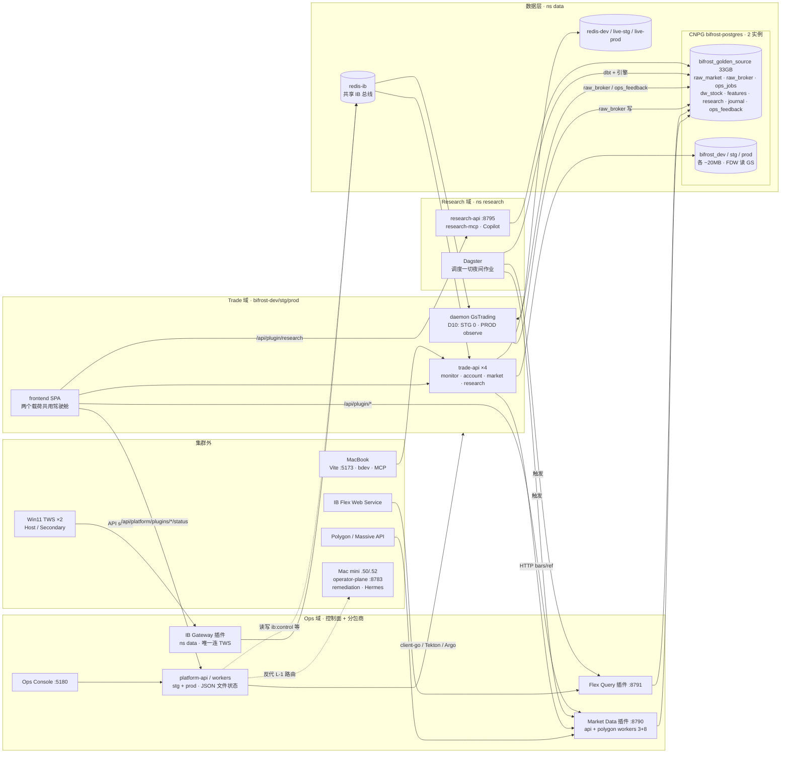

# Bifrost 系统架构现状（只读梳理 · 2026-10-05）

> 用途：为架构讨论做准备。全部基于读代码与只读实测（kubectl get / pg 只读查询），未改任何东西。
> 「观察」只陈述现象，不是提议。标注「实测」的是 2026-10-05 当场在集群上查到的。

---

## 0. 一句话心智模型

**一个人的期权研究与持仓驾驶舱，跑在家用 K3s 上。** 三个域：

- **Ops（火箭）**：`bifrost-platform` 控制面 + 三个「供数分包商」插件（IB Gateway / Market Data / Flex Query），负责把外部数据源接进来、把集群和发布管起来。
- **Research（决策载荷）**：`bifrost-research`，在 Golden Source 上用 dbt + 引擎算出选股、波动率、GEX、SEPA、复盘等结论。
- **Trade（执行载荷）**：`bifrost-trade-*`，按环境（DEV/STG/PROD）提供持仓、风险、策略记录、实时报价；交易 daemon 在 D10 冻结下只观察不下单。
- 前端 `bifrost-trade-frontend` 是两个载荷共用的**一个 SPA 驾驶舱**，随 Trade 链发布。

真正的「数据重心」不在 Trade 库，而在 **单实例共享的 `bifrost_golden_source`（33 GB，实测）**；三个 Trade 环境库各只有约 20 MB（实测）。

---

## 1. 业务价值：谁在用、用来做什么

使用者只有 Owner 一人（两个 IB 账户：U17123565 Host、U8829175 Secondary），外加一群代他干活的 Agent。

| 能力 | 成熟度（据 10-04 REVIEW） | 实际在用的价值 |
|------|------|------|
| Research / 选股选期权 | 最成熟 | SEPA 与动量筛选、5 透镜波动率评级、期权合约筛选、IV rank / 期限结构 / SVI / GEX / max pain / PCR、Kelly/ATR 仓位、Copilot（只读）、Journal |
| Portfolio / 风险（读侧） | 中上 | 多账户持仓、按 Trade（strategy_instance）分组、到期与指派推演、三方账本对账（Canonical / Book / TWS）、组合 Greeks、β-delta、压力测试、CAR / Backing |
| Review / 复盘 | 中 | P&L 日历、Review 页；Greeks 归因与 TWR 卡在「没有每日持仓快照」 |
| Strategy | 记录为主 | 规则模板、机会、分配、计划、gate-safety 均为 CRUD；`strategy_plan` 无执行消费者 |
| Gamma scalping daemon | 冻结 | FSM 在跑（PROD 2 副本 observe-safe），纸面模式与模拟对冲写死，`flatten` 未实现，协议里根本没有 place/cancel |
| Ops Platform | 支撑性 | 让「一个人 + Agent」能运维 6 节点集群、3 套环境、多条发布链、夜间数据作业；Agent 治理（模式、D10 闸门、审计、patrol、remediation） |

**观察**：系统的现有价值几乎全在「看清楚 + 想清楚」（Research + 读侧 Portfolio），而不是「做」。执行侧不是一个开关之隔，而是缺下单协议、适配器和平仓逻辑。

---

## 2. 架构图

---

## 3. 组件与职责

### Ops 域

| 组件 | 职责 | 消费者 |
|------|------|--------|
| `platform-api`（Go，:8780） | 环境矩阵探测、集群动作（client-go）、交付（Tekton/Argo）、发布闸门、programs/briefing、operate queue、telemetry、插件状态与代理 | Ops Console、MCP 桥（6 个 server）、trade-api 审计、market-data 插件拉 watchlist union |
| `PLATFORM_ROLE` | 同一二进制分 `api` / `workers`；workers 跑 IB 自愈、每小时 prod→dev/stg 数据克隆、patrol autopilot | — |
| operator-plane（L-1，:8783） | 集群外 Mac mini 上的带外面：agent-bridge、drift、Hermes、patrol 路由；platform-api 经 `OPERATOR_PLANE_URL` 反代 | Ops Agent |
| Ops Console（:5180） | Observe / Operate / Architecture 视图；spine（`ops-context.yaml`）是决策权威源 | Owner |
| IB Gateway 插件 | 唯一连接 TWS 的进程（client_id 70–73）；写 tick / 期权缓存 / 账户快照与流；服务 `ib:operator:cmd` RPC（DEV/STG 只读流） | Trade（ExternalName `redis-ib`，按环境 ACL 用户）、platform 探针 |
| Market Data 插件（:8790） | Polygon → `raw_market.*` + `ops_jobs.*`；拥有 DDL；也提供 SEPA/PCR/技术面等分析端点 | Research（约 53 个文件读 raw_market）、trade-api（HTTP + FDW）、前端 |
| Flex Query 插件（:8791） | IB Flex → `raw_broker.executions_raw_flex` / `transactions` | Trade（FDW `brokerage.*`）、Research（直读 raw_broker） |

### Research 域（ns `research`）

- dbt：`stg_*` → `int_*` → `mart_*`，落 `dw_stock.*`；引擎（volatility、vol_surface、gex、flow、momentum、sepa、scan、vrp、opex、forecast、event_radar、backtest、signal_hit、canonical_pnl、journal_distill…）写 `features.*`。
- research-api :8795 + research-mcp + Copilot（Copilot 挂在全站，读两边数据）。
- **Dagster 是全系统事实上的批处理调度器**：Research 自己的 25 个 CronJob 全部 suspend（实测），market-data 的 15 个 CronJob 也全部 suspend，由 Dagster 经 HTTP 触发；Flex 06:30 ET 也由 Dagster 触发。

### Trade 域（ns `bifrost-{dev,stg,prod}`）

| 进程 | 端口 | 做什么 | 写哪里 |
|------|------|--------|--------|
| api-monitor | 8765 | status / daemon / config、docs、ops（只读 ingest 视图）、`/control/*` | per-env Redis control stream、settings |
| api-account | 8769 | trading / strategy / portfolio | env 库 `strategy_*`、`trade_review` 等；GS `raw_broker` 手工成交与佣金 |
| api-market | 8772 | 报价与 SSE（读 `ib:ingester:*`）、bars、假日、watchlist | watchlist；在 redis-ib 登记按需 STK/OPT |
| api-research | 8773 | 期权发现、screener、greeks、数据就绪、feedback；代理 research-api | GS `ops_feedback.*` |
| daemon（GsTrading） | — | FSM BOOT→SYNC→IDLE→ARMED→MONITOR→NEED_HEDGE→HEDGING/SAFE；K8s Lease 选主；消费 `ib:account:stream:v1` | GS `raw_broker.account/positions/open_orders…`（DEV 由 env 开关关掉写） |
| frontend | — | 一个 SPA：`/research`（73 路由）、`/portfolio`、`/risk`、`/trade`、`/review`、`/settings`、`/system` 等 | — |

共享：`bifrost-trade-core`（纯库：config、持久化与 DDL、组合模型、ib_operator 客户端）、`bifrost-ui`（Trade 前端与 Ops Console 共用组件库）。

---

## 4. 数据流与存储

| 流 | 路径 | 落点 |
|----|------|------|
| 实时 IB | TWS → IB 插件 → `redis-ib`（`ib:ingester:tick:*` TTL 300、`ib:option:cache:*`、`ib:account:snapshot/stream:v1`）→ api-market SSE / daemon | 内存总线，无持久历史 |
| 账户同步 | `ib:account:stream:v1` → daemon（account_sync）→ | GS `raw_broker.*` |
| 市场数据 | Dagster → Market Data 插件（3 股票 + 8 期权 worker）→ Polygon | GS `raw_market.*`（26 GB，实测） |
| 研究计算 | Dagster → dbt → `dw_stock.*`（834 MB）→ 引擎 → `features.*`（5.7 GB）→ research-api | 前端直连 `/api/plugin/research`，或经 trade-api 代理 |
| 成交对账 | Dagster 06:30 ET → Flex 插件 → | GS `raw_broker`（2.7 MB）；Trade 经 FDW `brokerage.*` 读，Research 直读 |
| Trade 业务状态 | trade-api → | `bifrost_{env}.public.*`（18–19 张表：strategy、settings、review、watchlist、preferences） |
| Ops 状态 | platform-api → | **JSON 文件 + emptyDir**；spine 是 ConfigMap 里的 YAML；无数据库 |
| 作业元数据 | 插件 / Dagster / dbt | GS `ops_jobs`（920 MB）、`ops_dagster`、`ops_dbt` |

**实测连接分布（pg_stat_activity）**：GS 上有 `data_writer`（约 11 个 polygon worker × 5–6 连接）、`flex_writer`、`analytics_writer`（Research）、`feedback_writer`、`trade_app_dev/prod`、`brokerage_reader`（postgres_fdw 回环）；env 库只有各自的 `trade_app_<env>`。说明 TD-85 的按环境角色已部分生效。

---

## 5. 运行拓扑（实测 2026-10-05）

| 节点 | 状态 | 实际承载 |
|------|------|------|
| ubt-k3s-01 .73 | Ready，**SchedulingDisabled** | 控制面、NodePort 入口（Trade 网关 30880/1/2、Ops 30876–9、registry、gitea） |
| ubt-k3s-02 .70（prod-pool） | Ready | **全部 PROD Trade pod**、**CNPG 主库 bifrost-postgres-1**、redis-dev、redis-live-stg、dagster-daemon |
| ubt-k3s-04 .75（data-primary） | Ready | CNPG 副本 -3、ib-gateway、research-api/mcp、platform-api(prod) |
| ubt-k3s-05 .77 | Ready | redis-ib、redis-live-prod、MinIO（PG 备份）、STG、CI |
| ubt-k3s-06 .79 | Ready | 通用 |
| gpu-server .60 | **NotReady，SchedulingDisabled** | Ollama（`ai` ns 只剩 Service）、data-warehouse MinIO（0/0） |

- 环境：DEV / STG / PROD 三套 Trade + STG / PROD 两套 Platform；Research、插件、redis-ib、Golden Source 都**只有一套**，被三套环境共用。
- 发布：Tekton 构建 → Argo。Platform 与 Research 自动同步；Trade STG/PROD 手动同步；插件**不在 Argo**，手工 apply；DEV 没有 Argo app。
- daemon：DEV 1（禁写 GS）、STG 0（D10 overlay）、PROD 2（observe-safe，Lease 选主）。
- 遗留：`bifrost-stg` 里有一个 `guestbook-ui`（Argo 示例应用）在跑。

---

## 6. 两个系统如何互相依赖

**Trade → Ops（强依赖，运行时）**

1. 所有实时报价、账户数据、IB RPC 都只经 IB Gateway 插件 + redis-ib；插件挂了 Trade 就是瞎的。
2. 行情 bars / 参考数据经 Market Data 插件 HTTP 与 FDW。
3. 成交对账经 Flex 插件。
4. 前端插件状态读 PROD 的 platform-api（三个环境都指向 prod）。
5. api-monitor 把审计发给 platform-api；DEV 库由 platform workers 每小时从 PROD 克隆。

**Ops → Trade（应为零，实际不为零）**

- platform-api 读 Trade 专属的 IB 键（`ib:ingester:tick:NVDA|STK|||`、`ib:account:snapshot:v1`），写 `ib:control:<account>`，切换 gateway mock/live，认得 Trade 的旧 StatefulSet。
- platform 硬编码分析作业名（max-pain、atm-iv、iv-percentile、dbt-sepa），并把 Trade watchlist 中转给 Market Data 插件。
- Flex 插件 import `bifrost_core`（Trade 库）；IB 插件的键契约注释写着「必须与 bifrost-trade-socket 一致」。
- spine 的 `active_track` 是 `trade_ib_client_migration_rollout`，Trade 迁移 program 存在 platform config 里。

**Research ↔ 两边**

- 插件由 Research 的 Dagster 调度，但插件归 Ops 管。
- Research 直读 `raw_broker`，Copilot / MCP 默认打 PROD trade-api。

---

## 7. 观察到的风险与架构张力（只陈述，不提议）

### A. 环境隔离是「薄的」

1. **Golden Source 一套被 DEV/STG/PROD 共用**，而且是数据主体（33 GB vs 各 20 MB）。三个环境的 API 都能写共享的 `raw_broker`；DEV 的 daemon 只靠一个环境变量不写。Owner D3 选择暂时保留。
2. Research、插件、redis-ib 都是单实例。所谓 STG 验证，验证的是 Trade 代码，不是数据链路。
3. DB 角色：曾经一个 `bifrost` 密码贯穿 9 个 Secret；TD-85 的按环境角色已部分上线（实测有 `trade_app_<env>`），撤销与轮换截至 10-04 未执行；插件仍以 `bifrost` 连接。

### B. 「平台不懂业务」与现实不符

4. 双飞轮的验证测试（把 platform clone 到别的集群指向别的应用）今天过不了：platform-api 认得 IB 键、TWS clientId、分析作业名、Trade watchlist。
5. 插件被归为 Ops「分包商」，但它们的消费者、键契约、依赖（`bifrost_core`）和调度者（Dagster）都在业务侧。它们在组织上属于 Ops，在语义上属于 Trade / Research。
6. 没有插件注册契约：每个插件在 platform 里都是一个手写的 Go 包，外加 Console 上的 TS catalog。

### C. 控制面自身的耐久性

7. platform-api 状态是 emptyDir 上的 JSON 文件（operate queue、programs、patrol、release-cycles），审计日志在内存里只留 500 条且每个进程各一份，重启即丢；spine 里自己写着「迁 Postgres」已延后。
8. 部署进集群的 spine / clusters / auth 配置与 repo 版本漂移数百行；`meta.version` 停在 06-25。
9. 权限上的几个缺口：几个有副作用的 POST 没有鉴权（husbandry-sync 能派发 LLM 修复任务）；Trade 的审计 token 被授予 operator 角色；D10 的扩容守卫按名字匹配，只拦从 0 扩起；redis-ib 的 platform ACL 很宽。

### D. 单点与容量

10. **PROD Trade 全部 pod 与 CNPG 主库同在 .70**，data-primary 节点 .75 上只有副本。.70 一挂，PROD 应用和主库会同时失去。
11. gpu-server 当前 NotReady，Ollama 和第二个 MinIO 下线；「敏感推理留在 LAN」那条腿现在不在。
12. 控制面节点 .73 不可调度但承载所有 NodePort 入口；Mac mini 与本机 MacBook 是 L-1 与开发内环的一部分（本机睡眠会冻结 watcher）。

### E. 交付与耦合

13. 一个前端 SPA 横跨两个载荷，发布顺序不确定。靠「Research API 只向后兼容」加运行时 schema 校验维持。
14. 发布链有四种形态：Platform 与 Research 走 Argo 自动同步，Trade 手动同步，插件手工 apply，DEV 镜像另行同步。多会话共用一个 checkout，已出过撞车事故，靠 `release.sh window` 与守卫兜底。
15. 两套调度信号互相看不见：platform 的 next-fire 视图只看 CronJob，而 CronJob 全部 suspend，真实调度在 Dagster，所以这个视图永远是空的。

### F. 业务能力的缺口（影响架构方向）

16. 执行链不存在（无下单协议、无适配器、无平仓），所以 D10 解冻本身发不出任何单。
17. 缺每日持仓 / NAV 快照、缺期权 NBBO 历史，导致归因、TWR、回测与实盘对照都做不了；回测有已知 bug（B1–B7）；期权与股票历史在滚动物理删除。

---

## 8. 证据索引（节选）

- 事实基线：`AGENT_FACTS.md` §1–§8c；`bifrost-platform/config/ops-context.yaml:18-44`
- 业务成熟度与缺口：`REVIEW-trade-system-completeness-and-backtest-2026-10-04.md` §1–§2
- DB 角色：`REQUEST-trade-runtime-db-role-plan-2026-10-04.md` §1、§7、附录 B/C
- 平台越界：`bifrost-platform/api/internal/ibgateway/service.go:78-80,329-367`、`mode.go:27-60`、`marketdata/cronjob.go:14-30,52`、`marketdata/watchlist_union.go`
- 平台状态：`api/internal/actuation/audit.go:32-36`、`bifrost-trade-infra/k8s/base-platform/manifest.yaml`（emptyDir）
- 权限：`bifrost-platform/config/platform-auth.yaml:24-26`、`api/internal/cluster/actuation.go:148-150`、`bifrost-platform-plugin/k8s/redis-ib/acl.conf.example:11`
- daemon：`bifrost-trade-worker/src/bifrost_worker/daemon/app/gs_trading.py:83-84`、`control_heartbeat.py:142-143`；`bifrost-trade-core/src/bifrost_core/ib_operator/protocol.py:13-24`
- Flex 依赖 Trade：`bifrost-platform-plugin-flex-query/.../orchestration/trades.py:9`
- 共享 GS：`bifrost-trade-infra/k8s/data/databases.yaml`；DEV 写关闭 `overlays/dev/daemon-golden-writes-off.patch.yaml`
- 实测：`kubectl get nodes/deploy/cronjob/clusters.postgresql.cnpg.io`、`pg_database_size`、`pg_stat_activity`（2026-10-05 18:0x UTC）
