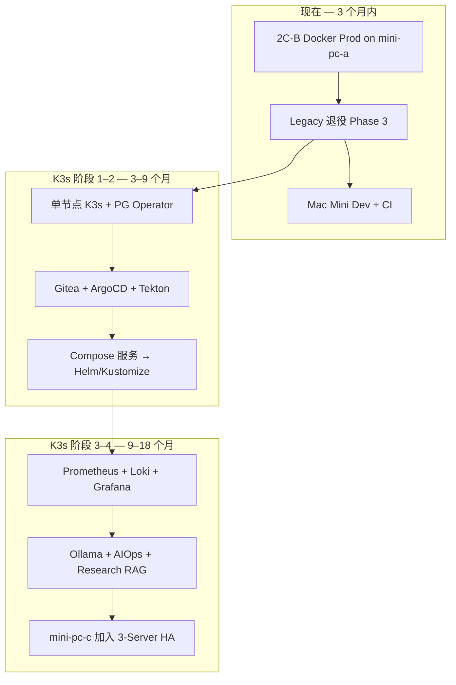

# 平台路线图 — Docker Compose → K3s

> **制定**：2026-06-08 · **状态**：执行中（2C-A 已关账，2C-B / K3s 分阶段推进）
>
> 本文整合：**当前硬件**、**Phase 2C 进度**、**[K3S_PLATFORM_ARCHITECTURE.md](K3S_PLATFORM_ARCHITECTURE.md)** 目标，给出可执行阶段计划。

---

## §1 当前硬件与角色映射

| 设备 | 现状 | 近期角色（2C-B） | K3s 目标（见 K3s 文档） |
|------|------|------------------|-------------------------|
| **Win11 ×2** | Host / Secondary **TWS 专机**（替代原 Mac Mini） | **集群外**：仅 TWS/Gateway；`IB_HOST` 指向其 LAN IP | 同上，永不入 K3s 工作负载 |
| **Linux mini-pc-a** | 原 Legacy Prod **`.70`** | **New Docker Prod**（2C-B 首选主机） | K3s Server ① · API / Redis / Ingress / Gitea / ArgoCD |
| **Linux mini-pc-b** | **PG 专机 `.80`** | **PostgreSQL**（`bifrost_prod` / `bifrost_dev`） | K3s Server ② · CloudNativePG Primary |
| **Linux mini-pc-c** | 规划中 / Legacy 退役后加入 | 暂闲置或 Staging | K3s Server ③ · 监控 / Tekton / AIOps |
| **Mac Mini ×2** | 闲置（M4） | **#1 Dev 常驻栈** · **#2 CI/Staging** | OrbStack K3s Agent · 前端 / 轻量 Runner |
| **MacBook** | 主开发机 | Cursor、`make prod-preflight-local`、验收 | kubectl / Claude + mcp-k8s |
| **4090 机** | 闲置 | 可选：本地 Ollama 试验 | K3s Agent `workload=gpu` · Ollama / Socket / Celery |
| **网络** | 路由 + 交换机 + VLAN + 3×UPS | 交易 VLAN 与 Dev/AI 隔离 | Traefik Ingress 仅内网 |

**与 K3s 文档的差异（需记住）**：

- K3s 文档写「三台 Mini PC」；你当前是 **2 台 Linux Mini 已落地 + 第 3 台为第二批** — 与 K3s §9 阶段 4 一致。
- TWS 在 **Win11** 而非 Mac Mini — Socket 通过 `IB_HOST` 连 LAN，原则与 ARCHITECTURE §2 相同。

---

## §2 软件完成度（决策基线）

| 里程碑 | 状态 | 含义 |
|--------|------|------|
| Phase 2B | **CLOSED** | 新前端 + 新 API（Dev 8765–8773） |
| 2C-A | **CLOSED** | Mac `localhost` compose + Session 0–9 |
| 2C-A.1 | **Owner 已验** | Ops docker executor、Socket/Celery 控制面 |
| **2C-B** | **规划中** | Linux 上 New Docker Prod，退役 Legacy |
| **K3s** | **规划未实施** | 不阻塞应用代码迁移；与 2C-B 串行 |

---

## §3 三阶段总览



---

## §4 阶段 A — 2C-B + 资源盘活（**当前优先**）

**目标**：在 **不等待 K3s** 的前提下，让 New 栈成为唯一 Prod，并腾出机器给后续集群。

### A1. 2C-B 生产切换（mini-pc-a / `.70`）

| 步骤 | 动作 |
|------|------|
| A1.1 | `.env`：`POSTGRES_*` → `.80` / `bifrost_prod`；`REDIS_*` → `.70`；`IB_HOST` → Win11 Host IP |
| A1.2 | `BIFROST_BUILD_LOCAL=0` 或 Linux monorepo build；`make prod-preflight` + `make prod-health` |
| A1.3 | 维护窗口：停 Legacy engine + 多端口 API；**R-DV3** 仅 New daemon 下单 |
| A1.4 | Owner 2C-B 签字 → [PHASE2C_SIGNOFF_MASTER.md](PHASE2C_SIGNOFF_MASTER.md) |

### A2. Mac Mini 分工

| 机器 | 服务 | 连接 |
|------|------|------|
| **Mac Mini #1** | `docker-compose.dev.yml` 全天 Dev 栈 | `bifrost_dev` @ `.80`；Dev `client_id` → Win11 |
| **Mac Mini #2** | Git runner + `make prod-health` 发布闸门 | 打 tag 前自动验；可选 Uptime Kuma |

### A3. 4090 机（轻量启动，不绑 Prod）

- 安装 **Ollama** + 一个 7B–32B 模型，仅供开发/运维问答试验。
- **禁止**接 Prod Redis、禁止 `ib:operator:cmd`。
- 为阶段 C 的 Research RAG 预留。

### A4. 需补的 infra 代码（Compose 时代）

| 产物 | 说明 |
|------|------|
| `scripts/release_gate.sh` | 聚合 `prod-health` + 可选 smoke URL |
| `docs/` + **MkDocs** | 本手册；`make docs` |
| CI workflow（Mac Mini #2） | PR：`pytest` / `npm run build` / `check-legacy-css` |

**阶段 A 出口**：Legacy 退役；`.70` 仅 New compose；Dev/CI 与 Prod 分离；Win11 仅 TWS。

---

## §5 阶段 B — K3s 基础 + GitOps（对齐 K3s 文档 §9 阶段 1–2）

**前置**：阶段 A 稳定 ≥2 周；`bifrost-trade-*` 镜像可重复构建。

### B1. 集群.bootstrap（mini-pc-a 先行）

1. mini-pc-a：Ubuntu 24.04 + K3s Server（单节点验证）
2. mini-pc-b：加入 Server；打 `node-role=postgres`
3. gpu-server：Agent + `workload=gpu`
4. Mac Mini：OrbStack Linux VM → Agent（可选，第二批）

### B2. 数据层迁移（`.80` → K3s，或过渡期双写）

**推荐路径**：

1. 先在 mini-pc-b 用 **CloudNativePG** 起 `bifrost-postgres`（K3s 文档 §4）
2. `pg_dump` / `pg_restore` 从现网 `.80` 迁入；应用改连 `bifrost-postgres-rw.data.svc`
3. 稳定后 `.80` 裸 PG 降为 Standby 或退役

Redis：Bitnami Redis Helm 在 `data` namespace，或短期仍用 `.70` 宿主机 Redis（减少一次迁移变量）。

### B3. 应用迁移顺序（与依赖一致）

```
data (PG, Redis)
  → bifrost namespace: socket → worker (daemon, celery) → api (×9) → frontend
  → ingress: Traefik 替代 nginx compose
```

每域一步 ArgoCD Application；保留 `docker-compose.local.yml` 供 Mac 开发至 K3s Dev 命名空间成熟。

### B4. CI/CD（K3s 文档 §5）

| 组件 | 部署位置 | 职责 |
|------|----------|------|
| **Gitea** | `cicd` @ mini-pc-a | 内网 Git；策略代码不出网 |
| **Tekton** | `cicd` + gpu-server / Mac Agent | 构建镜像；4090 跑重测试 |
| **ArgoCD** | `cicd` | GitOps；`argocd app sync` 替代 `compose up` |
| **Registry** | `cicd` | 内网镜像；`BIFROST_*_REF` → image digest |

### B5. 新增 repo / 目录（建议）

```
bifrost-trade-infra/
  k8s/
    base/          # Kustomize：api, worker, socket, frontend
    overlays/
      dev/
      prod/
  argocd/apps/     # Application manifests
  tekton/          # Pipeline templates
```

**阶段 B 出口**：Prod 跑在 K3s；Compose 仅 Dev；Gitea+ArgoCD 管发布。

---

## §6 阶段 C — AI 原生发布运维平台 + 下游业务（见 [Goal/AI_NATIVE_OPS_PLATFORM.md](../Goal/AI_NATIVE_OPS_PLATFORM.md)）

> **重点构建目标**：原「快速发布 + AI 重构」与「全网 AI 运维」已合并为 **AI 原生自发现 / 自维护 / 自修复** 平台；本平台承载后续 **页面持续重构** 与 **交易复盘 AI**。

### C1. AI 原生发布运维平台（合并原项目 1 + 2）

| 能力 | 实现 |
|------|------|
| **自发现** | K8s/Compose 服务清单 + Monitor/Ops/Socket 健康 + Git/镜像版本 → MCP 与 MkDocs |
| **自维护** | Tekton 构建测试；ArgoCD GitOps；`release_gate`；Mac Mini CI 哨兵 |
| **自修复** | Ops API L0–L2 分级；`bifrost-ops-mcp`；Ollama @ gpu-server；**禁止** LLM 直连下单 |
| **观测** | kube-prometheus-stack + Loki @ `monitoring`（mini-pc-c 加入后） |
| **推理壳** | Open-WebUI / Cursor MCP 读 Grafana、Loki、K8s 事件 |

**新代码**：

- `bifrost-ops-mcp`（`infra/tools/` 或独立 repo）
- `bifrost-trade-api`：`GET /ops/ai/context` 聚合健康摘要（可选）
- `scripts/release_gate.sh`（阶段 A 即需）

### C2. 下游业务 — 页面持续重构

- **Tekton**：tag 触发 `release_gate` + 镜像 push + ArgoCD sync
- **Cursor / Claude**：`MIGRATION_TRACKING` + Goal + migration-protocol；MCP 读发布与健康信号
- **Mac Mini Dev**：逐步迁到 K3s `bifrost-dev` namespace；Dense UI 迁移页经 CI 闸门后 Staging

### C3. 下游业务 — 交易复盘 AI

| 组件 | 位置 |
|------|------|
| 只读数据 | API research/trading/portfolio；或 PG 只读副本 |
| 向量库 | pgvector（CNPG 旁路）或 Qdrant @ gpu-server |
| 批处理 Job | K8s CronJob：日终复盘索引 |
| Agent 壳 | Open-WebUI / OpenClaw / Hermes — 接统一 MCP Tools |
| 前端（后期） | `/research/copilot` — 只读建议，无 `daemon_control` 写 |

**新代码**：

- `bifrost-research-agent`（或 `api-research/agent/`）：`replay_report.py`、`rag_indexer.py`
- MCP Tools：`query_positions`、`query_executions`、`sepa_readiness_summary`

**阶段 C 出口**：AI 原生运维平台可闭环 L0/L1；页面重构与复盘 AI 在同一发布底座上迭代；交易路径与 AI 完全隔离。

---

## §7 硬件还需买什么？

**12–18 个月内现有 7 台 + 第 3 台 Mini 足够。**

| 可选 | 触发条件 |
|------|----------|
| NAS | PG 备份要异地；MinIO 不够 |
| 独立 Redis 机 | Celery+实时行情把 mini-pc-a 打满 |
| 10Gb 交换机内网 | K3s 跨节点 PG 复制瓶颈 |

---

## §8 决策检查表（Owner）

- [ ] **2C-B** 确认 Prod 主机 = mini-pc-a（`.70`）？
- [ ] **PG** 短期保持 `.80` 裸机，K3s CNPG 作为阶段 B 迁移？
- [ ] **Mac Mini #1** = Dev compose，**#2** = CI？
- [ ] **K3s 第一批** 仅 mini-pc-a + mini-pc-b + gpu-server（Mac OrbStack 第二批）？
- [ ] **平台优先**：2C-B + `release_gate` 后再开 K3s 单节点？
- [ ] **复盘 AI**：pgvector vs Qdrant？（见 Goal §10）

---

## §9 与文档索引

| 文档 | 用途 |
|------|------|
| [Goal/AI_NATIVE_OPS_PLATFORM.md](../Goal/AI_NATIVE_OPS_PLATFORM.md) | **重点构建目标** — AI 原生发布运维平台 + 下游业务 |
| [K3S_PLATFORM_ARCHITECTURE.md](K3S_PLATFORM_ARCHITECTURE.md) | K3s 目标拓扑、CNPG、GitOps、AIOps 细节 |
| [PHASE2C_SIGNOFF_MASTER.md](PHASE2C_SIGNOFF_MASTER.md) | 2C-B Runbook、生产签字 |
| [MIGRATION_TRACKING.md](MIGRATION_TRACKING.md) | 代码迁移进度 |
| [DOCKER_BUILD.md](DOCKER_BUILD.md) | 镜像构建与 rebuild 策略 |

**MkDocs 本地阅读**：`pip install -r requirements-docs.txt && make docs`
